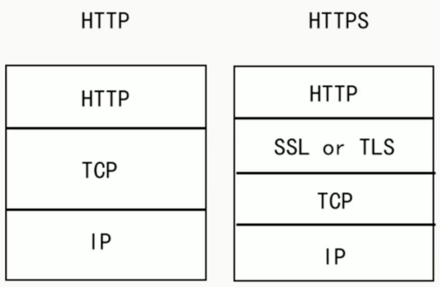
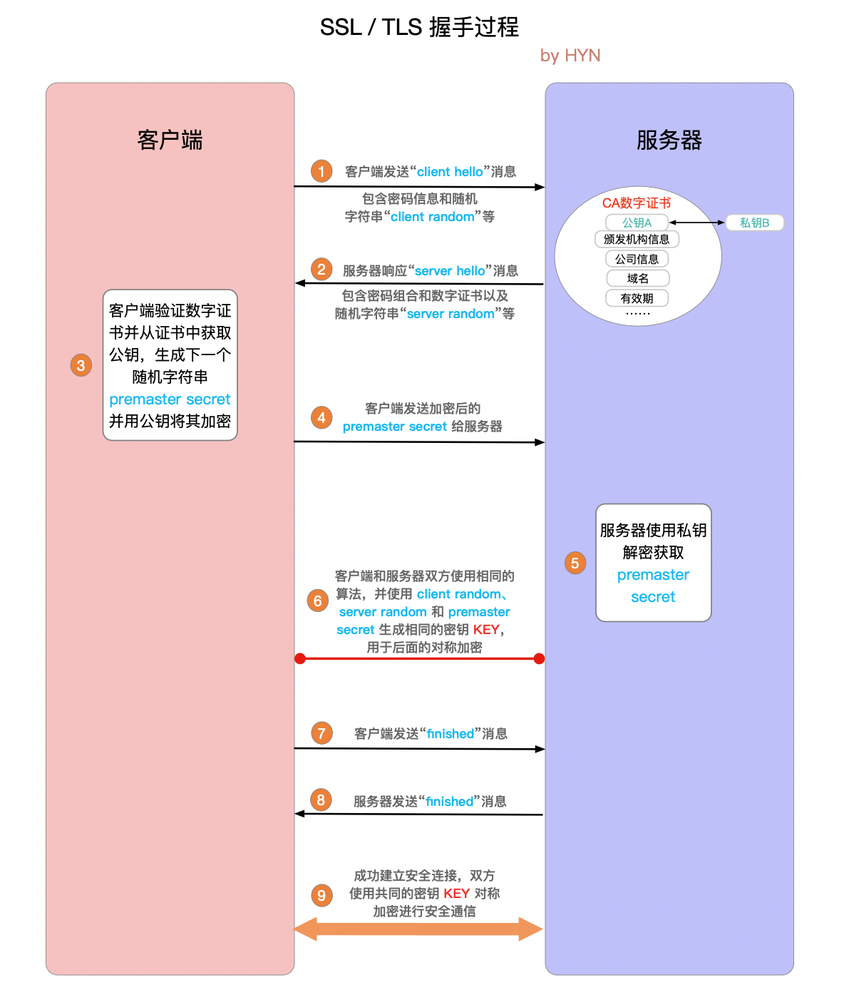
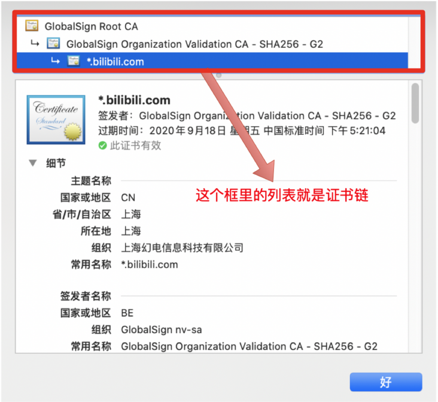
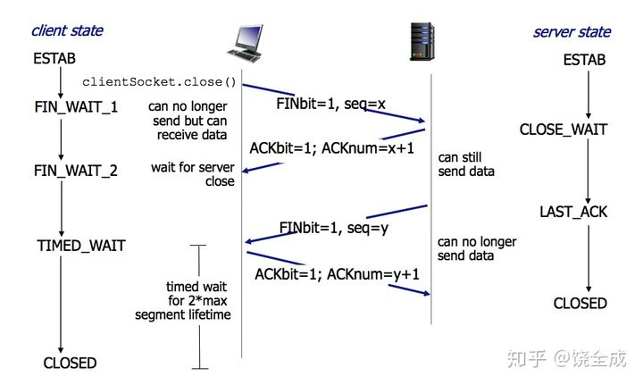
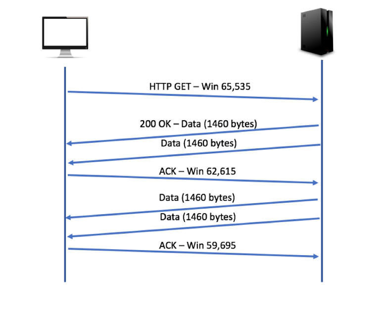
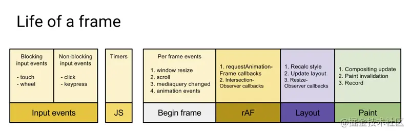
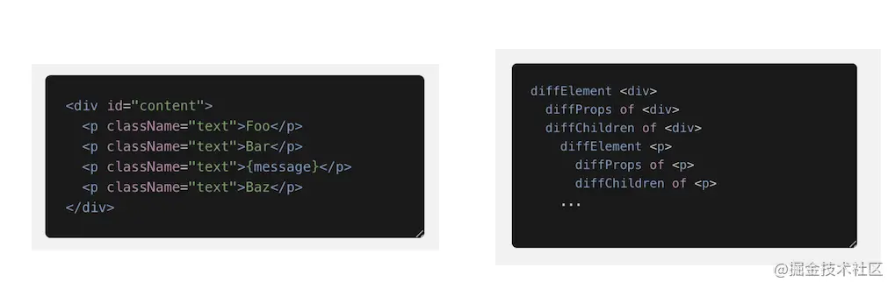

[toc]

#### 1.  **const引用是什么在栈什么在堆** ✔️


#### 2.  **箭头函数prototype** ✔️

#### 3.  **跨域 Cross-Origin Resource Sharing** ✔️

origin:   Protocol://Domain:Port

简单请求不会触发CORS预检: `get`, `head`, `post`. 
Content-Type

* text/plain
* multipart/form-data

复杂请求会触发preflight request: 为 OPTION 请求, 包含Access-Control-Allow-Headers/ Methods/ Origin/ Max-Age.

response:200后在 Access-Control-Max-Age 时间段内无需重复 preflight request.

> Access-Control-Max-Age (secend) will takes precedence when Access-Control-Max-Age exceed it.

withCredentials: true
Access-Control-Allow-Origin: http://foo.example
Access-Control-Allow-Credentials: true

jsonp:

```js

// 封装 JSONP函数
function jsonp({ url, params, callback }) {
    return new Promise((resolve, reject) => {
        let script = document.createElement('script');
        params = JSON.parse(JSON.stringify(params));
        let arrs = [];
        for (let key in params) {
            arrs.push(`${key}=${params[key]}`);
        }
        arrs.push(`callback=${callback}`);
        script.src = `${url}?${arrs.join('&')}`;
        document.body.appendChild(script);
        window[callback] = function (data) {
            resolve(data);
            document.body.removeChild(script);
        }
    })
}
// 前端调用
jsonp({
    url: 'http://localhost:3000/say',
    params: {
        wd: 'I Love you'
    },
    callback: 'show'
}).then(data => {
    console.log(data)
})

// 后端响应
// 这里用到了 express
var express = require('express');
var router = express.Router();
var app = express();
router.get('/say',function(req,res,next) {
 //要响应回去的数据
  let data = {
    username : 'zs',
    password : 123456
  }

  let {wd , callback} = req.query;
  console.log(wd);
  console.log(callback);
  // 调用回调函数 , 并响应
  res.end(`${callback}(${JSON.stringify(data)})`);
})
app.use(router);
app.listen(3000);
```

nginx简易配置:https://juejin.cn/post/6844904094973296654


#### 4.  **1px** 与rem ✔️

推荐适配方法: px为主，vx和vxxx（vw/vh/vmax/vmin）为辅，搭配一些flex. **用户之所以去买大屏手机，不是为了看到更大的字，而是为了看到更多的内容**

设置 1px 边框, 因为`devicePixelRatio`导致实际渲染为2px.


解决办法

 1. **viewport + rem**

    当 devicePixelRatio = 2 时

    ```html
    <meta name="viewport" content="initial-scale=0.5, maximum-scale=0.5, minimum-scale=0.5,user-scalbel=no">
    ```

    同时通过设置对应viewport的rem基准值. 

    rem是主流的移动端布局方案.

    **设置rem的方法**

    - [px2rem](https://github.com/songsiqi/px2rem),  可以用`px2rem-loader`, 也可以用 `postcss-px2rem`

    - js根据 `documentElement.clientWidth` 设置html的font-size大小

      ```js
      document.documentElement.style.fontSize =  document.documentElement.clientWidth / 750 + 'px';
      ```

    - 使用vw设置，vw也是一个相对单位，100vw等于屏幕宽度

      ```html
      html{
        font-size: 10vw;
      }
      ```

2. **伪类 + transform**

   判断是否为Retina屏:

   ```js
   if(window.devicePixelRatio && devicePixelRatio >= 2) {
       document.querySelector('ul').className = 'hairlines';
   }
   ```

   把原先元素的 border 去掉，然后利用 `:before` 或者 `:after` 重做 border ，并 transform 的 scale 缩小一半，原先的元素相对定位，新做的 border 绝对定位

   - 单条 border

   ```
   .hairlines li{
       position: relative;
       border:none;
   }
   .hairlines li:after{
       content: '';
       position: absolute;
       left: 0;
       background: #000;
       width: 100%;
       height: 1px;
       transform: scaleY(0.5);
       transform-origin: 0 0;
   }
   
   ```
   
   - 四条 border
   
   ```
   .hairlines li{
       position: relative;
       margin-bottom: 20px;
       border:none;
   }
   .hairlines li:after{
       content: '';
       position: absolute;
       top: 0;
       left: 0;
       border: 1px solid #000;
       box-sizing: border-box;
       width: 200%;
       height: 200%;
       transform: scale(0.5);
       transform-origin: left top;
   }
   ```
   
   

#### 5.  **offset, client, scroll  的区别** ✔️

| 属性   | 值                           |
| :----- | :--------------------------- |
| client | top/left/width/height        |
| offset | top/left/width/height/parent |
| scroll | top/left/width/height        |

**clientWidth**: it's the inner width of an element in pixels. It includes padding but excludes borders, margins, and vertical scrollbars (if present).

**clientTop**: The width of the top border of an element in pixels.


**offsetWidth**: element's CSS width, **including any borders, padding, and vertical scrollbars in pixels**.

**offsetTop**: the distance of the outer border of the current element **relative to** the inner border of the top of the **[`offsetParent`](https://developer.mozilla.org/en-US/docs/Web/API/HTMLElement/offsetParent) node**.


**scrollWidth**: the width of an element's content, including content not visible on the screen due to overflow.

**scrollTop**: the number of pixels that the [`element`](https://developer.mozilla.org/en-US/docs/Web/API/Element)'s content has been scrolled upwards. When an element's content does not generate a vertical scrollbar, then its `scrollTop` value is `0`.


#### 6.  **blob, file, arrayBuffer的区别** ✔️

**Blob**: binary  large  object.

blob 是对 arrayBuffer 的封装, arrayBuffer可对二进制数据的细节进行操作.

FileReader 可以将 Blob 读取为不同的格式.

```js
const blob = new Blob( arrayBuffer, options );

blob.size; // Blob对象中包含的数据字节数
blob.type; // 包含数据的MIME类型。例如若为图片，此字段就类似为’image/jpeg‘.如果类型未知，则该值为空字符串

const fileB = blob.slice(start, end, MIMEcontentType) // 只读, 按索引切割出一个新的指定MIME类型文件
```

**ArrayBuffer**: 更底层的二进制数据容器. 内存上一段连续的二进制数据.

**File**: 继承自 Blob 对文件对象. 也为二进制数据. 

`<input type="file">`选取到的 FileList 对象, 或者拖拽的 DataTransfer 对象.

新增属性:

`File.name` 只读, 为当前 File 对象所引用文件的名称。

**FormData**: 表单控件中附加的 `FormData` 对象, 包含一组 key: value,  其中的值可以使用 Blob / File 对象. 这个 `FormData` 可以快速的用于 `XHR.send(formdata)`, 此时发送请求的 `Content-Type`为 multipart/form-data.


#### 7. **nodeJs如何连接数据库，并且操作数据的** ✔️

Sequelize 是 ORM (Object Relational Mapping).


跳过 ----------------------------------------


#### 8.  **getBoundingRect()** ✔️


#### 9.  **cookie用来存什么(session id)   storage存什么** ✔️

**Session:**

* **session 是基于 cookie 实现的**，session 存储在服务器端,格式自定义，sessionId 会被存储到客户端的cookie 中, cookie只能是字符串
* session 是另一种记录服务器和客户端会话状态的机制
* 需要查询数据库, 如果加快, 多半是用redis存在内存中
* **session也可以不在cookie中, 把sessionId放在url参数中**, 移动端不常用

**Token:**

* 通常由access token 和 refresh token组成, 时效长短不同.  如果要重新申请refresh token需要重新登录
* Refresh Token 及过期时间是存储在服务器的数据库中，只有在申请新的 Acesss Token 时才会验证，不会对业务接口响应时间造成影响，也不需要向 Session 一样一直保持在内存中以应对大量的请求
* 客户端收到 token 以后，用 cookie 里或者 localStorage把它存储起来
* token 完全由应用管理，所以它可以避开同源策略
* **token 可以避免 CSRF 攻击** (因为不需要 cookie 了)
* 移动端对 cookie 的支持不是很好，而 session 需要基于 cookie 实现，所以移动端常用的是 token

**JWT:**
* JWT： 将 Token 和 Payload 加密后存储于客户端，服务端只需要使用密钥解密进行校验（校验也是 JWT 自己实现的）即可，不需要查询或者减少查询数据库，因为 JWT 自包含了用户信息和加密的数据。
* Token：服务端验证客户端发送过来的 Token 时，还需要查询数据库获取用户信息，然后验证 Token 是否有效。
* 可以储存在 Cookie 里面，也可以储存在 localStorage.  发送时可以在 POST 的 body 中, 也可以在 request header 的 Authorization: 中
* 是特定格式的字符串 Header(头部).Payload(负载).Signature(签名算法)
* 由于包含了认证信息, 有效期需要短一些

[使用这几者需要考虑的问题](https://juejin.cn/post/6844904034181070861#heading-21)

**Cookie 和 Session 的区别**

* 安全性： Session 比 Cookie 安全，Session 是存储在服务器端的，Cookie 是存储在客户端的。
* 存取值的类型不同：Cookie 只支持存字符串数据，想要设置其他类型的数据，需要将其转换成字符串，Session 可以存任意数据类型。
* 有效期不同： Cookie 可设置为长时间保持，比如我们经常使用的默认登录功能，Session 一般失效时间较短，客户端关闭（默认情况下）或者 Session 超时都会失效。
* 存储大小不同： 单个 Cookie 保存的数据不能超过 4K，Session 可存储数据远高于 Cookie，但是当访问量过多，会占用过多的服务器资源。

**Token 和 Session 的区别**
* Session 是一种记录服务器和客户端会话状态的机制，使服务端有状态化，可以记录会话信息。而 Token 是令牌，访问资源接口（API）时所需要的资源凭证。Token 使服务端无状态化，不会存储会话信息。
* **Session 和 Token 并不矛盾**，作为身份认证 Token 安全性比 Session 好，因为每一个请求都有签名还能防止监听以及重放攻击，而 Session 就必须依赖链路层来保障通讯安全了。如果你需要实现有状态的会话，仍然可以增加 Session 来在服务器端保存一些状态。
* Session 认证只是简单的把 User 信息存储到 Session 里，因为 SessionID 的不可预测性，暂且认为是安全的。而 Token ，如果指的是 OAuth Token 或类似的机制的话，提供的是 认证 和 授权 ，认证是针对用户，授权是针对 App 。其目的是让某 App 有权利访问某用户的信息。这里的 Token 是唯一的。不可以转移到其它 App上，也不可以转到其它用户上。Session 只提供一种简单的认证，即只要有此 SessionID ，即认为有此 User 的全部权利。是需要严格保密的，这个数据应该只保存在站方，不应该共享给其它网站或者第三方 App。所以简单来说：如果你的用户数据可能需要和第三方共享，或者允许第三方调用 API 接口，用 Token 。

#### 10. **jsonp  屏蔽c网站  request header里的refer?** origin? host? ✔️

* host 请求头表示请求服务器的域名/IP地址和端口号。 
  域名 + 端口号.
  例子：test.com:1998
  Host 请求头决访问哪个虚拟主机。

  

* referer 为当前请求的来源页面的地址，即表示当前请求是通过此referer页面里的链接进入的。
  协议+域名+端口号+路径+参数（不包含 hash值）
  例子：test.com:1998/home?key=value
  用途: 图片防盗链

  

* origin: 跨域时会带上, 表示请求源.
协议+域名+端口号

#### 11. **不写key值  bug?** ✔️
bug似乎没有. 写key值对于react只是当前元素无需删除, 只需要就地复用, 有助于提高diff速度.
* key相同，若组件属性有所变化，则react只更新组件对应的属性；没有变化则不更新。
* key值不同，则react先销毁该组件(有状态组件的componentWillUnmount会执行)，然后重新创建该组件（有状态组件的constructor和componentWillUnmount都会执行）

#### 12. **打包优化用的插件   dll  cache  thread** ✔️
thread-loader将耗时的单独一个线程.
cache: { type: 'filesystem' }
dllPlugin 已经无了, webpack5的持久换缓存比dll更优. create-react-app和vue-cli也已经去除了.
cache-loader 也不需要了
terser-plugin官方集成

#### 13. **深拷贝 (考虑循环引用, 不考虑函数) **✔️

要点:  

1. 判断是否为对象或函数. 不是对象则直接返回. 无需区别判断数组.
2. 判断constructor, 如果为 `Boolean`, `Date`, `String`, `Regexp`, `Number`类型, `return new Constructor(obj)`. (要注意 `Boolean` 要为 `+obj`, 否则都为 true )
3. `cloneObj = new Constructor()`, 随后, 对`Object.getOwnPropertyNames(obj)
       .concat(Object.getOwnPropertySymbols(obj))` 进行遍历, 递归调用 `deepClone`.

```js
const isObject = obj => obj !== null && (typeof obj === 'object' || typeof obj === 'function');
const isFunction = obj => typeof obj === 'function'
function deepClone(obj, hash = new WeakMap()) {
  if (hash.get(obj)) {
    return hash.get(obj);
  }
  if (!isObject(obj) || isFunction(obj)) {
    return obj;
  }

  const Constructor = obj.constructor;

  switch (Constructor) {
    case Boolean:
      return new Constructor(+obj);
    case Date:
    case Number:
    case String:
    case RegExp:
      return new Constructor(obj);
  }
  let cloneObj = new Constructor();
  hash.set(obj, cloneObj);

  Object.getOwnPropertyNames(obj)
    .concat(Object.getOwnPropertySymbols(obj))
    .forEach(k => {
        cloneObj[k] = deepClone(obj[k], hash);
    });
  return cloneObj;
}
```

测试: 
```js
const symbolName = Symbol();
const obj = {
  objNumber: new Number(1),
  number: 1,
  objString: new String('ss'),
  string: 'stirng',
  objRegexp: new RegExp('\\w'),
  regexp: /w+/g,
  date: new Date(),
  function: function () { },
  array: [{ a: 1 }, 2],
  [symbolName]: 111
}
obj.d = obj;
function testClone() {
  const o = deepClone(obj)
  console.log(o.objNumber === obj.objNumber);
  console.log(o.number === obj.number);
  console.log(o.objString === obj.objString);
  console.log(o.string === obj.string);
  console.log(o.objRegexp === obj.objRegexp);
  console.log(o.regexp === obj.regexp);
  console.log(o.date === obj.date);
  console.log(o.function === obj.function);
  console.log(o.array[0] === obj.array[0]);
  console.log(o[symbolName] === obj[symbolName]);
}
```

#### 14. **TLS** ✔️



**TLS握手中发生了什么**

- 商定双方通信所使用的的 TLS 版本 (例如 TLS1.0, 1.2, 1.3等等)；
- 确定双方所要使用的密码组合；
- 客户端通过服务器的公钥和数字证书 (上篇文章已有介绍)上的数字签名验证服务端的身份；
- 生成会话密钥，该密钥将用于握手结束后的对称加密。

**握手流程**



1. **"client hello"消息：**客户端通过发送"client hello"消息向服务器发起握手请求，该消息包含了客户端所支持的 TLS 版本和密码组合以供服务器进行选择，还有一个"client random"随机字符串。
2. **"server hello"消息：**服务器发送"server hello"消息对客户端进行回应，该消息包含了数字证书，服务器选择的密码组合和"server random"随机字符串。
3. **验证：**客户端对服务器发来的证书进行验证，确保对方的合法身份，验证过程可以细化为以下几个步骤：
   1. 检查数字签名
   2. 验证证书链 (这个概念下面会进行说明)
   3. 检查证书的有效期
   4. 检查证书的撤回状态 (撤回代表证书已失效)
4. **"premaster secret"字符串：**客户端向服务器发送另一个随机字符串"premaster secret (预主密钥)"，这个字符串是经过服务器的公钥加密过的，只有对应的私钥才能解密。
5. **使用私钥：**服务器使用私钥解密"premaster secret"。
6. **生成共享密钥**：客户端和服务器均使用 client random，server random 和 premaster secret，并通过相同的算法生成相同的共享密钥 **KEY**。
7. **客户端就绪：**客户端发送经过共享密钥 **KEY**加密过的"finished"信号。
8. **服务器就绪：**服务器发送经过共享密钥 **KEY**加密过的"finished"信号。
9. **达成安全通信：**握手完成，双方使用对称加密进行安全通信。

**重要概念**

1. **数字证书 (digital certificate)：**在非对称加密通信过程中，服务器需要将公钥发送给客户端，在这一过程中，公钥很可能会被第三方拦截并替换，然后这个第三方就可以冒充服务器与客户端进行通信，这就是传说中的“中间人攻击”(man in the middle attack)。解决此问题的方法是通过受信任的第三方交换公钥，具体做法就是服务器不直接向客户端发送公钥，而是要求受信任的第三方，也就是证书认证机构 (Certificate Authority, 简称 CA)将公钥合并到数字证书中，然后服务器会把公钥连同证书一起发送给客户端，私钥则由服务器自己保存以确保安全。数字证书一般包含以下内容：

   1. 证书所有者的公钥

   2. 证书所有者的专有名称

   3. 证书颁发机构的专有名称

   4. 证书的有效起始日期

   5. 证书的过期日期

   6. 证书数据格式的版本号

   7. 序列号，这是证书颁发机构为该证书分配的唯一标识符

      ... ...

2. **数字签名 (digital signature)：**这个概念很好理解，其实跟人的手写签名类似，是为了确保数据发送者的合法身份，也可以确保数据内容未遭到篡改，保证数据完整性。与手写签名不同的是，数字签名会随着文本数据的变化而变化。具体到数字证书的应用场景，数字签名的生成和验证流程如下：

   1. 服务器对证书内容进行信息摘要计算 (常用算法有 SHA-256等)，得到摘要信息，再用私钥把摘要信息加密，就得到了数字签名
   2. 服务器把数字证书连同数字签名一起发送给客户端
   3. 客户端用公钥解密数字签名，得到摘要信息
   4. 客户端用相同的信息摘要算法重新计算证书摘要信息，然后对这两个摘要信息进行比对，如果相同，则说明证书未被篡改，否则证书验证失败

3. **证书链 (certificate chain)：**证书链，也称为证书路径，是用于认证实体合法身份的证书列表，具体到 HTTPS 通信中，就是为了验证服务器的合法身份。之所以使用证书链，是为了保证根证书 (root CA certificate)的安全，中间层可以看做根证书的代理，起到了缓冲的作用，如下图所示，这里还以 B 站证书为例：



证书链从根证书开始，并且证书链中的每一级证书所标识的实体都要为其下一级证书签名，而根证书自身则由证书颁发机构签名。客户端在验证证书链时，必须对链中所有证书的数字签名进行验证，直到达到根证书为止。

4.**密码规范和密码组合 (CipherSpecs 和 CipherSuites)：**通信双方在安全连接中所使用的算法必须符合密码安全协议的规定，CipherSpecs 和 CipherSuites 正好定义了合法的密码算法组合。CipherSpecs 用于认证加密算法和信息摘要算法的组合，通信双方必须同意这个密码规范才能进行通信。而 CipherSuites 则定义了 SSL / TLS 安全连接中所使用的加密算法的组合，该组合包含三种不同的算法：

1. 握手期间所使用的的密钥交换和认证算法 (最常用的是 RSA 算法)
2. 加密算法 (用于握手完成后的对称加密，常用的有 AES、3DES等)
3. 信息摘要算法 (常用的有 SHA-256、SHA-1 和 MD5 等)


#### 15. TCP的三次握手四次挥手 ✔️

initial sequence number ,window size, 为什么是3次和4次等等)

```sequence
Title: TCP握手

Note left of 客户端: CLOSED
Note right of 服务端: LISTEN
Note left of 客户端: 发送 Syn 请求建立连接,\ninitial Seq num x


客户端 -> 服务端: Syn=1, Seq=x 
Note left of 客户端:SYN SENT
Note right of 服务端:SYN RCVD
Note right of 服务端: choose init Seq y\n发送 Syn+ACK 报文(Syn=1),\nACK=x+1表示确认收到
服务端 -> 客户端: Syn=1, ACK=1,ack=x+1, Seq=y
Note left of 客户端:ESTAB
Note left of 客户端: 收到ACK=x+1表示服务已上线,\n发送ack以响应Syn,\n这段可能携带传给客户端的数据,\n如果带数据则传seq

客户端 -> 服务端: ACK=1, ack=y+1,(seq=x+1)
Note right of 服务端: ESTAB
Note right of 服务端: 收到ACK=y+1表示客户端已上线

```


**四次挥手**

> 双方ESTABLISHED
>
> 1. 浏览器: 请求发送完, 准备关闭,不发送,可接受, FIN=1, seq=x,FIN_WAIT-1
>
> 2. 服务器: 请求接收完, 准备关闭,仍然可能发送, ACK=1, ack=x+1, CLOSE_WAIT, FIN_WAIT_2
>
> 3. 服务器: 响应发送完, 告知准备关闭,等待最后ack, FIN=1, ack=x+1, seq=z, LAST_ACK
>
> 4. 浏览器: 响应接受完, 等2MaxiumSegmentLifetime关闭, ACK=1, ack=z+1, TIME_WAIT
>
>    等待2MSL如果没收到ACK, 双方CLOSED



##### 为什么要三次握手?

为了确保双方都能明确自己和对方的收发能力是正常的, 少一次则无法确认.

第一次client发到server: 

	server确定: client 发送, server 接收 正常

第二次server发到client: 

	client确定: server 发送 接收,  client 发送 接收 正常

第三次client发到server:

	server确定: client 接收, server 发送 正常


##### 为什么建立连接是三次握手，而关闭连接是四次挥手？

因为服务端在LISTEN状态下，收到建立连接请求的SYN报文后，把ACK(应答)和SYN(同步)放在一个报文里发送给客户端。

而关闭连接时，当服务端收到FIN报文时，仅表示客户端不再发送数据了但是还能接收数据，所以只能先回复一个ACK报文，不能和FIN一起发送, 告诉客户端，"你发的FIN报文我收到了"。只有等到服务端所有的报文都发送完了才能发送FIN报文，因此不能和ACK一起发送。故需要四次挥手。

`MSL`为一个报文段的最大生存时间, 是报文段被丢弃前在网络内的最常时间.

##### ISN (initial sequence number) 不是固定的

建立链接选择初始 seq 时的 ISN 是虽时间而变化的.

##### 半连接队列

服务器收到客户端的SYN后, 会处于SYN_RCVD状态, 未完全建立链接, 服务器会把这种状态的请求放在一个**队列**里, 称之为**半连接队列**.

建立了三次握手后, 会放入**全连接队列**.

当服务器发送完`SYN-ACK`包后, 如果未收到Client的`ACK`包, 服务器会进行重传, 如果还未收到`ACK`会进行第二次重传, 重传时间一般会逐渐增长.  SYN攻击Client在短时间内伪造大量不存在的ip地址, 向Server不断发送SYN包, Server恢复确认包等待Client确认, 而ip不存在, Server需要不断重发知道超时, 这些伪造的SYN包长时间占用未连接队列, 倒是正常的SYN请求因为队列满而被抛弃, 这是一种典型的 Dos/DDoS 攻击,.

##### 为什么释放连接前要等待2MSL

> **MSL**是Maximum Segment Lifetime的英文缩写，可译为“最长报文段寿命”，它是任何报文在网络上存在的最长时间，超过这个时间报文将被丢弃。

为了保证客户端发送的最后一个ACK报文段能够到达服务器。因为这个ACK有可能丢失，从而导致处在LAST-ACK状态的服务器收不到对FIN-ACK的确认报文。服务器会超时重传这个FIN-ACK，接着客户端再重传一次确认，重新启动时间等待计时器。最后客户端和服务器都能正常的关闭。假设客户端不等待2MSL，而是在发送完ACK之后直接释放关闭，一但这个ACK丢失的话，服务器就无法正常的进入关闭连接状态。

- 1个 MSL 保证四次挥手中主动关闭方最后的 ACK 报文能最终到达对端
- 1个 MSL 保证对端没有收到 ACK 那么进行重传的 FIN 报文能够到达


##### TCP Receive window size (滑动窗口)

imply put, it is a **TCP receive buffer size for incoming data** that has not been processed yet by the application.

For many applications, since clients tend to receive data rather than send it, clients often have a larger allocated window size. After the handshake, the client sends an HTTP GET request to the server, which is quickly processed. Two response packets from the server arrive at the client, which sends an acknowledgment along with an updated window size. Each TCP header will display the most recent window value, which can grow or shrink as the connection progresses.




**The acknowledgements from the client indicate that the window is shrinking**. As long as the window value does not fall to zero, this behavior will largely go unnoticed by the end user. Although the number is slightly reduced, there is still plenty of room in the buffer for data transfer to continue. In many cases, the client can catch up and will process the data out of the buffer, clearing the window out and increasing the window value.

The TCP header value allocated for the window size is two bytes long. This means that the highest possible numeric value for a receive window is 65,535 bytes. In today’s networks, this window size is not enough to provide optimal traffic flow. 

**To increase TCP receive window exponentially** ,the specific function is called **TCP Window Scaling**, which is advertised in the handshake process. When advertising its window, a client or server will also advertise the scale factor (multiplier) that will be used for the life of the connection.

(Window size scaling factor: 4)

#### 15. **XMLHttpRequest** ✔️

open方法参数: ( METHOD, url, isAsync = true );
`send( requestBody )`
`abort() `取消
`xhr.withCredentials = true` 带cookie.
onreadystatechange, 五个值, XMLHttpRequest.固定值0-4分别是:   
UNSENT, OPENED (open已调用), HEADERS_RECEIVED (send已调用), LOADING (下载中), DONE (下载完成)

#### 16. **Server Component** ❌

#### 17. **SSR注水脱水** ❌

#### 18. **TCP 和 UDP 的区别** ✔️

**OSI七层模型**


物理层: 通过光缆, 电缆, 无线电波等方式将设备连接起来组网, 以二进制传输

数据链路层: 根据以太网协议将一组电信号组成一个数据包, 称作'帧', 传输有地址的帧, 错误检测                                                                                                                                                                                                                                                                                                                                                                                                                                                                                                                                                                                                                                                                                                                                                                                                                                                                                                                                                                                                                                                                                                                                                                                                                                                                                                                                                                                                                                                                                                                                                                                                  

网络层: 建立 主机-主机 的连接, IP选址与路由选择, 为数据包选择路由, IP

传输层: 建立,管理, 维护 端口-端口 的连接  TCP/UDP

会话层: 建立,管理,维护 会话

表示层: 数据格式转化, 数据加密, 代码转换

应用层: 为应用提供服务

**TCP/IP四层模型**

- 应用层：应用层、表示层、会话层：HTTP
- 传输层：传输层：TCP/UDP
- 网络层：网络层：IP
- 数据链路层：数据链路层、物理层

**UDP**:

1. 无连接, 不需要握手, 直接传输, 面向无连接

2. 支持一对多, 多对多, 多对一的传输

3. 不可靠性. 不需要建立连接, 不关注是否正确接收数据. 

4. 即使网络条件不好, 也不会调整发送速率. 但对于实时性要求高的场景(比如电话会议), 就使用UDP而不是TCP.

5. UDP HEADER 开销小, 传输报文高效.

   |              | UDP                                        | TCP                                    |
   | :----------- | :----------------------------------------- | :------------------------------------- |
   | 是否连接     | 无连接                                     | 面向连接                               |
   | 是否可靠     | 不可靠传输，不使用流量控制和拥塞控制       | 可靠传输，使用流量控制和拥塞控制       |
   | 连接对象个数 | 支持一对一，一对多，多对一和多对多交互通信 | 只能是一对一通信                       |
   | 传输方式     | 面向报文                                   | 面向字节流                             |
   | 首部开销     | 首部开销小，仅8字节                        | 首部最小20字节，最大60字节             |
   | 适用场景     | 适用于实时应用（IP电话、视频会议、直播等） | 适用于要求可靠传输的应用，例如文件传输 |

#### 19. **fiber的作用是什么** ✔️

通过调度, 让浏览器及时的响应用户的交互, 协调render, layout, print, source loading, HTML parseing, event response, 分批延时对DOM进行操作, 给用户制造一种应用很快的假象, 给浏览器一点喘息的机会, 对代码进行编译优化(JIT)及代码热优化, 对reflow进行修正.

JS是单线程运行的. GUI 渲染和 Javascript执行 两者是互斥的.

**对于’前端框架‘来说，解决这种问题有三个方向**:

- 1️⃣ 优化每个任务，让它有多快就多快。挤压CPU运算量
- 2️⃣ 快速响应用户，让用户觉得够快，不能阻塞用户的交互
- 3️⃣ 尝试 Worker 多线程

**React 在渲染时会递归比对VirtualDOM树，找出需要变动的节点，然后同步更新它们, 一气呵成。这个过程 React 称为 `Reconcilation`(中文可以译为`协调`)**.

在 **Reconcilation** 期间，React 会霸占着浏览器资源，一则会导致用户触发的事件得不到响应, 二则会导致掉帧，用户可以感知到这些卡顿。

协程, 类似`generator`, 不同于普通`function`, 可以中断可恢复.

通过**超时检查的机制来让出控制权**, 使用 `requestIdleCallback` API



一阵内会依次执行:

- 用户输入事件
- run JS
- window resize, scroll, mediaquery changed, animation events
- requestAnimationFrame, IntersectionObserver
- Layout
- Paint

理想的一帧时间是 `16ms` (1000ms / 60)，如果浏览器处理完上述的任务(布局和绘制之后)，还有盈余时间，浏览器就会调用 `requestIdleCallback` 的回调。

React 目前定义了**5个优先级, 高优先级的任务将会率先执行** 

- `Immediate`(-1) - 这个优先级的任务会同步执行, 或者说要马上执行且不能中断

- `UserBlocking`(250ms) 这些任务一般是用户交互的结果, 需要即时得到反馈

- `Normal` (5s) 应对哪些不需要立即感受到的任务，例如网络请求

- `Low` (10s) 这些任务可以放后，但是最终应该得到执行. 例如分析通知

- `Idle` (没有超时时间) 一些没有必要做的任务 (e.g. 比如隐藏的内容), 可能会被饿死

**`workLoop`会从更新队列(updateQueue)中弹出更新任务来执行，每执行完一个`执行单元`，就检查一下剩余时间是否充足，如果充足就进行执行下一个`执行单元`，反之则停止执行，保存现场，等下一次有执行权时恢复**


在 React 16 之前, Reconlication 是同步递归执行的, 是基于函数调用栈的. 但不能随意中断, 难以恢复, 不利于异步处理, 如果要恢复地柜现场只能从头开始调用以恢复到之前的调用栈.

目前 React 使用`链表`来代表 VirtualDOM, 每个 VirtualDOM 节点内使用`Fiber`表示, 结构大概为: 

```typescript
export type Fiber = {  
    // Fiber 类型信息  
    type: any,  
    // ... 
    
    // ⚛️ 链表结构  
    // 指向父节点，或者render该节点的组件
    return: Fiber | null, 
    // 指向第一个子节点
    child: Fiber | null,  
    // 指向下一个兄弟节点
    sibling: Fiber | null, 
}
```


React Fiber 也被称为虚拟栈帧(Virtual Stack Frame), 函数调用栈类比, 结构非常像:

|          | 函数调用栈   | Fiber            |
| -------- | ------------ | ---------------- |
| 基本单位 | 函数         | Virtual DOM 节点 |
| 输入     | 函数参数     | Props            |
| 本地状态 | 本地变量     | State            |
| 输出     | 函数返回值   | React Element    |
| 下级     | 嵌套函数调用 | 子节点(child)    |
| 上级引用 | 返回地址     | 父节点(return)   |


`Reconcliation`不再会递归去吊比, 不会马上 commit 变更. 包含副作用(Effect)的收集和提交


#### 20. **react Diffing算法** ✔️

render函数执行会产生react元素树，下次render会产生另外一个元素树，react需要对比两个元素树差别，来更新同步真实DOM，使用最简单的广度优先遍历，时间复杂度达到O(n^3)
react使用O(n)启发式算法，提出以下两个假设：

1. 不同的元素肯定会产生不同的树
2. 可以使用key来指定哪一些元素不用更新

**元素树的更新有以下几种情况：**

1. 无需更新
2. 全新的节点，新增一个DOM阶段
3. 需要修改属性的节点，更新样式或者其他属性
4. 不需要的节点，需要删除

#### 21. **react的优化方法** ❌

#### 21. **优化, 提升页面性能** ✔️

1. 资源压缩, 减少HTTP请求
2. 非核心代码异步加载
(script的异步加载有几种方式，区别是什么？)
<script>标签中的async属性
异步加载的方式:
1) 动态脚本加载  2) defer  3) async
异步加载的区别
1) defer: HTML解析完后 DOMContentLoaded触发时才执行, 如果有多个, 按照加载的顺序一次执行
2) async: 异步加载, 不会阻塞, 加载完之后立即执行, 如果有多个, 执行顺序和加载顺序无关
不加这俩, 加载 JS 会阻塞浏览器，浏览器必须等待 js 加载和执行完毕才能去做其它事情。
所以, 如果依赖其他js的执行结果或者DOM, 用 defer, 否则用 async.


**dns预解析:** 

1. HTML源码下载后, 会解析页面包含的链接标签, 提前查询对应域名
2. 对于访问过的页面, 浏览器会纪录一份域名列表, 当再次打开此页面时, 会在html下载的过程中解析 DNS.

当浏览器遇到类似`href`属性时 (images, css, js..), 自动将`href`的域名解析为IP地址, 解析过程与用户浏览网页并行进行, 为了确保安全, `HTTPS`页面中不会自动解析.

开启`HTTPS`自动解析:

```HTML
<meta http-equiv="x-dnsprefetch-control" content="on">
```

一般只需要在整个站点的入口页加上即可.

手动解析某域名: 

```html
<link rel="dns-prefetch" href="//img.alicdn.com">
```


#### 22. **性能优化  react和webpack** ❌
#### 23. **plugin和loader** ❌

#### 24. **迁移ts遇到的问题** ❌

#### 25. **打开url发生了什么** ❌

1. DNS解析(网址->IP地址）：DNS缓存：浏览器，操作系统
分级查询：本地DNS服务器，根域名服务器，COM顶级域名服务器，google.com域名服务器
2. TCP连接（三次握手）-> 为什么两次不可以？
3. 发送HTTP请求
4. 服务处理请求, 并且返回HTTP报文
5. 浏览器解析和渲染页面
6. 连接结束四次挥手 -> 为什么三次不可以


##### 旧版:

1. DNS解析, 将域名解析成IP
URL格式: `scheme://host.domain:port/path/filename`
>1、浏览器中输入想要访问的网站的域名，操作系统会先检查本地的hosts文件是否有这个网址映射关系，如果有，就先调用这个IP地址映射，完成域名解析。
2、如果hosts里没有这个域名的映射，客户端会向本地DNS服务器发起查询。本地DNS服务器收到查询时，如果要查询的域名包含在本地配置区域资源中，则返回解析结果给客户机，完成域名解析。
3、如果本地DNS服务器本地区域文件与缓存解析都失效，则根据本地DNS服务器的设置，采用递归或者迭代查询，直至解析完成。

2. TCP连接, 三次握手
双方listen
一, 浏览器: 将要发送请求, SYN=1,seq=x, SYN_SENT
二, 服务器: 已准备接受, 浏览器可以发送,SYN=1,ACK=1,ack=x+1,seq=y,SYN_RECV
三, 浏览器: 已准备发送,ACK=1,ack=y+1,seq=y+1,ESTABLISHED
双方ESTABLISHED

[面试官问我：一个 TCP 连接可以发多少个 HTTP 请求？](https://www.jianshu.com/p/0ac515088cec)

这之后可能会发生TLS握手

3. 发送HTTP请求
 请求行:  请求方法  URL  协议版本: `POST /chapter17/user.html HTTP/1.1`
4. 服务器处理并返回HTTP响应

首先浏览器会判断状态码是什么，如果是 200 那就继续解析，如果 400 或 500 的话就会报错，如果 300 的话会进行重定向，这里会有个重定向计数器，避免过多次的重定向，超过次数也会报错
浏览器开始解析文件，如果是 gzip 格式的话会先解压一下，然后通过文件的编码格式知道该如何去解码文件

5. 浏览器解析渲染页面

#### 浏览器渲染过程

1. 将HTML自上而下解析成DOM tree。
2. 当遇到style或link的css文件，浏览器会开启一个异步的线程去下载和CSS解析成 CSSOM tree，该线程会阻塞js线程的执行，但不会阻塞html线程的解析。
2. 遇到 script 标签的话，会判断是否存在 async 或者 defer ，
前者網頁繪製不會停下， demo.js 在背景下載，待 [DOMContentLoaded](https://www.google.com.tw/search?q=DOMContentLoaded) 再執行 demo.js
后者網頁繪製不會停下， demo.js 在背景下載。
待 demo.js 下載完畢，網頁繪製停下，執行 demo.js 。
待 demo.js 執行完畢，網頁繪製繼續。
如果以上两个属性都没有，就会阻塞住渲染流程直到 JS 下载执行完毕, 之后才将控制权返还给html解析器继续解析构建dom树
3. 根据DOM树和CSSOM来构造Render Tree(只包括渲染网页所需的节点，
HTML 被完全加载和解析后会触发 DOMContentLoaded 事件
4. 通过渲染树，layout计算每个节点精确位置和大小。
5. 绘制，并使用UI后端层绘制每个节点图层.

断开TCP连接, 四次挥手
双方ESTABLISHED 
一, 浏览器: 请求发送完, 准备关闭,不发送,可接受,FIN=1,seq=x,FIN_WAIT-1
二, 服务器: 请求接收完, 准备关闭,仍然可能发送,ACK=1,ack=x+1,seq=y,CLOSE_WAIT,FIN_WAIT_2
三, 服务器: 响应发送完, 告知准备关闭,等待最后ack,FIN=1,ack=x+1,seq=z,LAST_ACK
四, 浏览器: 响应接受完, 等2MaxiumSegmentLifetime关闭,ACK=1,ack=z+1,seq=x+1,TIME_WAIT
等待2MSL如果没收到ACK, 双方CLOSED

#### 26. **ES6 与 Common JS 的区别有什么** ✔️

1）CommonJS模块是加载时执行。一旦出现某个模块被“循环加载”，就只输出已经执行的部分，没有执行的部分不会输出。已经require的对象会被缓存, 第二次require不会重复执行.

2）ES6模块对导出模块，变量，对象是动态引用，遇到模块加载命令import时不会去执行模块，只是生成一个指向被加载模块的引用。

CommonJS模块规范主要适用于后端Node.js，后端Node.js是同步模块加载，所以在模块循环引入时模块已经执行完毕。


#### 27. **eventBus 观察者模式** ❌

#### 28. **HMR. 什么是manifest, vender, chunk ** ✔️

- **manifest** 用于 `CommonsChunkPlugin` , webpack bootstrap logic into a separate file.
- 

```javascript
new webpack.optimize.CommonsChunkPlugin({
  name: 'manifest',
  minChunks: Infinity,
});
```

- **vender**指第三方库.


[HMR配置说明与原理](https://mp.weixin.qq.com/s?__biz=MzA3OTU5MjgyOQ==&mid=2452485097&idx=1&sn=08ff33d9be4eb21da0857461024f4cb5&chksm=88687ffbbf1ff6ed38d5da1ebe16f49f1c33c300d822bef85a8ae456b4dcd9798b2dc84eafed&scene=178&cur_album_id=1953291458153594882#rd)

> 在开发过程中，我们经常会用到webpack-dev-server，它有一个默认自带的功能就是live reloading（实时重新加载）功能。在命令行中运行 webpack serve，如果你更改任何源文件并保存它们，webpack-dev-server将在编译代码后自动刷新浏览器。
> 但是这样有个缺点，如果我们需要先进行一些操作，比如打开一个对话框，再调试对话框的样式。或者经过一些特定的查询后，来调试一个列表的样式。如果浏览器在改完代码后直接刷新了，那么我们还需要去通过打开对话框或者再去做特定的查询来验证刚才的修改效果。HMR即hot module replacement（模块热更新）就解决了这个问题，它保留了在完全重新加载页面期间丢失的应用程序状态，允许在运行时只更新被修改的模块，而无需完全刷新。webpack-dev-server 支持 hot 模式，在试图重新加载整个页面之前，hot 模式会尝试使用 HMR 来更新。

#### 29. CSRF 和 XSS

#### 30. Promise再扫一眼. 有什么缺点? Promise.race ✔️

缺点: Promise 功能太少了。

##### 没有获取状态方法：isRejected，isResolved

标准 Promise 没有提供获取当前状态 rejected 或者 resolved 的方法。只允许外部传入成功或失败后的回调。我认为这其实是优点，这是一种声明式的接口，更简单。

##### 缺少其它一些方法：always，progress，finally

always 可以通过在 then 和 catch 里重复调用方法实现。finally 也类似。progress 这种进度通知的功能还没有用过，暂不知道如何替代。

##### 不能中断，没有 abort、terminate、onTimeout 或 cancel 方法

Fetch 和 Promise 一样，一旦发起，不能中断，也不会超时，只能等待被 resolve 或 reject。幸运的是，whatwg 目前正在尝试解决这个问题 [whatwg/fetch#27](https://github.com/whatwg/fetch/issues/27)

#### 31. Generator

#### 32. EventLoop ✔️

* macro task: `Script`, `setTimeout`, `setInterval`, `setImmediate`, `I/O`, UI rendering
* micro task: `process.nextTick`, `Promise.then`

#### 33. 柯里化 ✔️

```js
function add(...args) {
  const innerAdd = function (...innerArgs) {
    args.push(...innerArgs);
    return innerAdd;
  }
  innerAdd.toString = () => args.reduce((a, b) => a + b);
  return innerAdd;
}
```


#### 34. 进程和线程的区别 ✔️

**进程是资源分配的最小单位，线程是CPU调度的最小单位**

进程时间段
= CPU加载程序上下文的时间
\+ CPU执行时间
\+ CPU保存程序上下文的时间 （实质就是一个程序开始运行到运行结束的时间，针对一个程序只创建了一个进程的情况）

（注意：一个程序可能创建多个进程，这时候一个进程的结束不代表程序运行结束）

**切换进程上下文的成本更高, 一个进程执行时中间切分为多个线程. **

线程时间段
= CPU加载线程上下文的时间
\+ CPU执行时间
\+ CPU保存线程上下文的时间 （是更为细小的时间段，远小于进程时间段）

**线程是共享了进程的上下文环境，的更为细小的CPU时间段。线程主要共享的是进程的地址空间。**


#### 34. 迁移TS的时候遇到了哪些问题

#### 快排

#### 33. **项目经经历吹点小作文** ❌

#### 34. **自我介绍** ❌


面试官下午好，我叫**，今天来应聘贵公司的前端工程师岗位。我从事前端开发三年多，第一年主要开发RN应用, 部分活动页, 小程序和后台管理系统，在上家公司主要从事后台管理系统重构, 组件开发, BFF接口等项目开发。平常喜欢逛一些技术社区丰富自己的技术，像思否，掘金之类，记录自己的工作总结和学习心得。 

> 你好，我叫xxx，我上一家公司是做XXX。，所以我们公司做的项目都是和XXX相关的。
>  刚进公司的那时候，什么交互啊，项目需求，测试，代码编写，优化，我都有积极的参与，因为是新人，所以好好把握住每个学习的机会，我的本职工作，前端这块，我都是认真负责完成。那时候虽然很忙，压力很大，但真的是学到了不少东西，后期项目都不断的在完善，我也不断的在参与。
>  在上一家公司中，我的收获不单单是技术方面，主要还有业务能力，自学能力和同事的沟通能力，这都是我学到的，而且是我认为很重要的。
>  技术方面我一直从事于web方面的工作，掌握的前端技术有ajax，js， vue， html ， css， 我也了解java语言和数据库表结构这块，与后台人员能更有效的沟通。
>  我的性格方面不算外向，也不算内向，跟朋友，同事相处，比较外向，在工作中，代码开发时，我是比较内向的，我喜欢全心全意的投入工作中。我也喜欢交朋友，偶尔跟朋友聚聚，聊聊。对于工作我总是抱着认真负责，有责任心，吃苦耐劳的态度工作。
>  谢谢，以上是我的自我介绍。

1.做过什么。介绍个人履历。把自己曾经做过的事情说清楚，对应时间节点的工作单位、工作地点、工作岗位、担任职务、工作内容等，尤其是对最近几年做过的事情要重点来说。较早之前的工作经验，或者学习的经验可以一带而过，要把握“重点突出”的原则。

#### 35. 项目具体介绍


#### 36.简历修改, 附面向SEO报菜名

<div ><p>我整理一下近年来流行的套路。首先是面向关键词 SEO 报菜名：</p>
<ul>
<li>本人年轻时就用 Vue + Vue Router + Vuex + ElementUI 做过 XX 管理后台 A。</li>
<li>本人年轻时也用 React + Redux + Antd 做过 XX 管理后台 B。</li>
<li>本人年轻时还用 jQuery + Bootstrap + RequireJS 做过 XX 首页 C。</li>
</ul>

<p>然后要体现做题家气质：</p>
<ul>
<li>熟悉 JS 底层原理（<i>指背过 == 比较结果之类的犄角旮旯语言特性</i>）</li>
<li>熟悉浏览器底层原理（<i>指对那道「从输入网址到展示页面发生了什么」的题对答如流</i>）</li>
<li>熟悉数据结构和算法（<i>指偷偷刷过 LeetCode Easy</i>）</li>
<li>熟悉计算机网络（<i>指能秒答 HTTP 状态码，还能接着告诉你 TCP 和 UDP 的区别</i>）</li>
<li>熟悉 Linux 系统（<i>指 mkdir 和 sudo rm -rf</i>）</li>
<li>熟悉前端工程化（<i>指抄 webpack 和 babel 配置来用</i>）</li>
<li>熟悉性能优化（<i>指把前端优化 24 条建议和 35 条军规等博客背得滚瓜烂熟</i>）</li>
<li>熟悉源代码管理工具（<i>指实在不行就 git push -f</i>）</li>
<li>熟悉函数式编程思维（<i>指会用 reduce 代替 for 循环求数组最大值</i>）</li></ul>

<p>最后展示一下技术沉淀，升华一下政治正确：</p>
<ul>
<li>性格严谨，制定过团队技术规范（<i>指配置全家桶</i>）</li>
<li>富有热情，持续关注技术热点（<i>指朋友圈转发前端营销号推送</i>）</li>
<li>热爱编程，希望长期深入前端技术（<i>指没有用过 JavaScript 以外的编程语言</i>）</li>
<li>认真负责，具有一定的管理能力（<i>指带过实习生和外包</i>）</li>
<li>阳光开朗，能融入团队（<i>指破冰之类羞羞的事情都没有关系啦</i>）</li>
<li>勤奋皮实，抗压能力强（<i>指什么不用说了吧</i>）</li>
</ul>

<p>暗号都对上了，还怕面试不通过吗？</p></div>


#### 以上在今天完成 ❌

